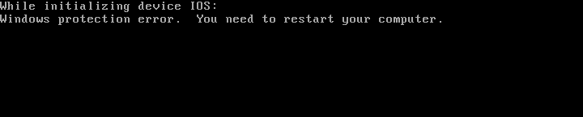
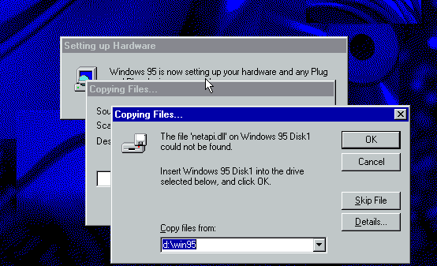
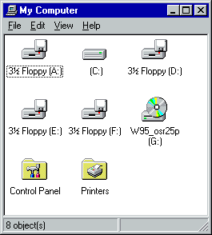

This document describes some common problems and their solutions when running Windows 95 in VirtualBox.

It was tested with **VirtualBox 6.0** against the Windows 95 versions I have lying around.

# Can't boot - Windows Protection Error while initializing IOS, NDIS, ...

The emulated CPU is too fast for Windows 95.

### Windows 95 RTM/a version

You're out of luck. You might be able to use [FIX95CPU](http://lonecrusader.x10host.com/fix95cpu.html) (`FIX95CPU_V3_FINAL.ZIP`, sha256sum 7618245fcc1005a975006c5f625ebf581a58309491642c8fdc9eef583deb0d40).

### Windows 95 OSR 2 (b/c version)

Microsoft released an update known as the **AMD K6 Update** (`amdk6upd.exe` sha256sum: 664f3b087e51a81ce25eba239e64ac37f178340d41ffa1f090ac816f89b6165d)
which fixes the problem. The AMD K6 was the first processor fast enough to trigger the bug.

Back in the days, you would have artificially slowed down the machine using the turbo button or a BIOS settings and then install the update in Windows,
but that is not possible in a VM. You can try to set a CPU limit to get a similar effect but I didn't succeed in doing so.

How can you do it today?

* Use your favorite archive extraction tool (I recommend [7-zip](https://7-zip.org)) to extract the files from `amdk6upd.exe` and copy them onto a floppy
* Boot Windows in `Command Prompt Only` mode (i.e. DOS mode), or boot from a DOS bootdisk, or a linux live CD or whatever
* Update the files manually:

        C:\WINDOWS\SYSTEM\IOSUBSYS\ESDI_506.PDR
        C:\WINDOWS\SYSTEM\IOSUBSYS\HSFLOP.PDR
        C:\WINDOWS\SYSTEM\IOSUBSYS\SCSIPORT.PDR
        C:\WINDOWS\SYSTEM\IOSUBSYS\CDFS.VXD
        C:\WINDOWS\SYSTEM\IOSUBSYS\DISKTSD.VXD
        C:\WINDOWS\SYSTEM\VMM32\IOS.VXD
        C:\WINDOWS\SYSTEM\VMM32\INT13.VXD
        C:\WINDOWS\SYSTEM\VMM32\VFBACKUP.VXD

  If you have installed the USB supplement or if the USB supplement was already integrated into your version of Windows 95, also update

        C:\WINDOWS\SYSTEM\VMM32\NTKERN.VXD

  (if you don't know whether you need the `NTKERN.VXD` update, leave it out and see if your system boots. If it complains about an error in `NTKERN.VXD`, you'll need the updated file.)

# Windows 95 Setup can't find the setup files during device installation

### You're installing from floppies

You probably fell victim to the *4 floppy drives bug* described below. To continue with setup:

* try other drive letters (`D:`, `E:`, `F:`, `G:`) and see if the floppy is recognized there.
* if that doesn't work, skip the file and see below for instructions on how to fix the fallout.

### You're installing from CD

Windows 95 Setup can only access the CD during the second stage of setup if you used a `DRVCOPY.INF` file to install a real-mode CD driver. See my `win95-bootdisk-with-cdrom.md` tutorial for creating a setup bootdisk which gets it right.

Your only option now is to skip the file and then fix the fallout later (see below).

### Alternative: Copy everything to the hard disk

You can work around this problem by copying the files from the `WIN95` onto your
hard disk and install from there. It is also possible to patch the setup files
to do that for you, see [win95-setup-copy-cabs-to-hdd.md](win95-setup-copy-cabs-to-hdd.md).

# Windows 95 complains about missing components and other breakage caused by skipping files during setup

This can be fixed by reinstalling the affected device drivers.

* Make sure that the Windows 95 setup files (CD or floppies) can be accessed by Windows.
* Go into the *Device Manager* (right-click on `My Computer`, `Properties`) and remove every device with a yellow exclamation mark next to it.
* Reboot.

After the reboot, Windows 95 will detect the removed devices and install the drivers from the Windows 95 CD or floppies.

# Windows 95 shows 4 floppy drives

The Windows 95 floppy driver doesn't quite like the emulated floppy drive.
The easiest solution is to go into the device manager (right-click on `My Computer`, `Properties`)
and remove the floppy controller. Then reboot.

Windows 95 will then access the floppy drive using MS-DOS compatibility mode, which works fine for our purpose.

# No audio output

Make sure you emulate a SoundBlaster 16 with the default settings.

Launch the `Add New Hardware` wizard in the Control Panel, it will detect the audio card and install drivers for it.

Note that the *4 floppy drives bug* might return since the `Add New Hardware` wizard will detect the floppy controller, too. See above.

# I want higher screen resolution and more than 16 colors

Higher screen resolutions are possible with the [VBEMP](https://bearwindows.zcm.com.au/vbe9x.htm) driver (`140214.zip`, sha256sum: 1b852dc62fbba02ac6cc615b45ea749fdc8807c369c27bd1d4906f320d7ea33b or `vbemp9x.zip`, sha256sum: f9246091ccb626f2fece700a438cb4448f922e2a58e7d757fb5f6a435cf07efb).

* You should use the driver in the `UNI` subfolder when using the `vbemp9x.zip` version or one of the `032MB`, `064MB`, `128MB` subfolders when using the `140214.zip` version.
* Install via *Control Panel*, *Display*, *Settings*, *Advanced Properties*, *Adapter*, *Change...*, *Have Disk...*
* RunDLL32 will crash when installing the driver. The Installation succeeded anyway, press `Close` and reboot.
* Make sure to **increase the amount of video RAM** in the virtual machine settings to **at least 64MB**, otherwise the screen will stay black
* If Windows 95 requests you to specify a monitor, choose *Plug and Play Monitor*

